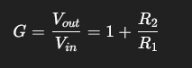
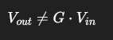
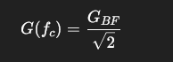
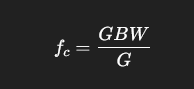
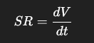
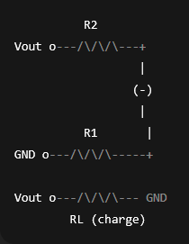

# Validation expérimentale d’un amplificateur opérationnel

## Objectif du travail

Ce projet vise à caractériser expérimentalement un amplificateur opérationnel LM741 en montage non-inverseur, à l’aide :

- d’un générateur de fonctions

- - d’un oscilloscope

et d’un script Python (VISA)

Les mesures sont réalisées :

- hors labo (OFFLINE) avec instruments simulés

- au labo réel avec instruments Rigol

## Matériel utilisé

#### Électronique

- Amplificateur opérationnel LM741

- Alimentation symétrique (±12 V ou ±15 V)

- Résistances :

    - R1 = 4.7 kΩ

    - R2 = 4.7 kΩ → gain ≈ 2

    - Charges : 10 kΩ, 1 kΩ, 470 Ω

#### Instruments

- Générateur de fonctions Rigol

- Oscilloscope Rigol

- Connexion VISA (USB)


---

# Principe général de mesure
Chaque caractéristique du LM741 est mise en évidence en faisant varier un paramètre clé :

| Caractéristique     | Paramètre varié          |
| ------------------- | ------------------------ |
| Gain statique       | Amplitude                |
| Bande passante      | Fréquence                |
| Saturation          | Amplitude                |
| Slew rate           | Forme d’onde + fréquence |
| Réponse transitoire | Signal carré             |
| Offset              | Entrée nulle             |
| Courant de sortie   | Résistance de charge     |

Un seul paramètre à la fois, tous les autres constants.

---

## Organisation du projet par blocs

* Bloc 0 - Mode OFFLINE (simulation)

Objectif

- Valider tout le code sans instruments réels

Principe

- Générateur et oscilloscope simulés

- Modélisation :

    - gain

    - bande passante (1 pôle)

    - slew rate

Utilisation
```python
OFFLINE = True   # chez soi
OFFLINE = False  # au labo
```


---

* Bloc 1 -  Détection des instruments

Objectif

Vérifier que le générateur et l’oscilloscope sont bien détectés via VISA.

Méthode

- Liste des ressources VISA

- Sélection manuelle des IDs

Toujours fait en premier au labo

---

* Bloc 2 - Prise en main du générateur
Objectif

Envoyer des signaux maîtrisés vers le montage.

Signaux utilisés

- Sinus : mesures linéaires

- Carré : réponses transitoires

- Rampe / triangle : slew rate

- Sweep : bande passante

Exemples :
```python
ch1_sine(1000, 1.0)
ch1_square(1000, 1.0)
ch1_ramp(10000, 10.0)
```

---

* Bloc 3 - Lecture oscilloscope + plot

Objectif

Lire les signaux Vin et Vout et les afficher.

Méthode

- Lecture brute via :WAV:DATA?

- Reconstruction du temps et de la tension

- Tracé Vin / Vout

Permet de valider visuellement le montage

---

* Bloc 4 - Gain statique

Vérifier le gain en boucle fermée.

Méthode

1. Sinus basse fréquence (1 kHz)

2. Amplitude faible (pas de saturation)

3. Mesure Vpp entrée / sortie

Formule :



---

* Bloc 5 - Saturation de sortie (Output Swing)

Objectif

Observer les limites de tension de sortie.

Méthode

- Fréquence constante (1 kHz)

- On augmente Vin progressivement

- On observe l’écrêtage de Vout

La saturation apparaît quand :



---

* Bloc 6 - Bande passante / fréquence de coupure

Objectif

Déterminer la fréquence de coupure −3 dB.

Méthode

- Vin constant

- Balayage en fréquence

- Calcul du gain en fonction de f

Critère −3 dB :



Relation théorique:



---

* Bloc 7 - Slew rate

Objectif

Mesurer la pente maximale de sortie.

Méthode

- Signal rampe ou carré

- Fréquence suffisamment élevée

- Mesure de la pente maximale :



Indépendant du gain statique.

---

* Bloc 8 - Réponse transitoire

Objectif

Observer le comportement dynamique lors d’un échelon.

Méthode

- Signal carré

- Mesure :

    - temps de montée (10–90 %)

    - overshoot

LM741 = ampli à pôle dominant → réponse stable, peu d’overshoot.

---

* Bloc 9 - Offset de sortie

Objectif

Mesurer la tension de sortie avec entrée nulle.

Méthode

- Entrée = 0 V

- Couplage DC

- Mesure de la valeur moyenne

Lien théorique :


---

* Bloc 10 - Courant de sortie

Objectif

Montrer que le LM741 ne peut pas fournir un courant élevé.

Méthode

- Vin constant

- Variation de la résistance de charge

- Calcul du courant :

Iout=VoutRL

En réel : limitation vers ~20 mA.

